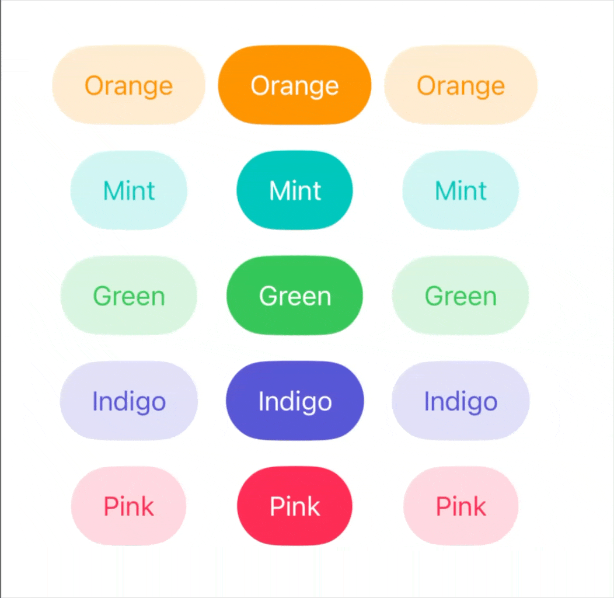

# ButtonStyleBackport

`ButtonStyleBackport` is a tiny Swift Package that backports modern
SwiftUI button styles through the reusable `Backport` wrapper.

It builds on [`swift-backport-pattern`](https://github.com/inekipelov/swift-backport-pattern)
and provides compatibility fallbacks for Liquid Glass button styles.

<p align="center">
  <a href="https://swift.org"></a>
  <a href="https://developer.apple.com/ios/"></a>
  <a href="https://developer.apple.com/macos/"></a>
  <a href="https://developer.apple.com/tvos/"></a>
  <a href="https://developer.apple.com/watchos/"></a>
  <a href="https://developer.apple.com/visionos/"></a>
</p>

## Preview

<p align="center">
  
</p>

## Usage

```swift
import SwiftUI
import ButtonStyleBackport

Button("Continue") {
    // Action
}
.buttonStyle(.backport.glass)

Button("Confirm") {
    // Action
}
.buttonStyle(.backport.glassProminent)

Button("Custom Glass") {
    // Action
}
.buttonStyle(.backport.glass(.regular.interactive(true).tint(.blue)))

Button("Secondary") {
    // Action
}
.buttonStyle(.backport.borderedProminent)
```

The system-style helpers are also backported:

| Backport style | Behavior |
| --- | --- |
| `.backport.glass` | Uses native `SwiftUI.Glass` on iOS 26, macOS 26, tvOS 26, and watchOS 26. Falls back to `.backport.bordered` elsewhere. |
| `.backport.glass(_:)` | Mirrors SwiftUI's configurable glass API and falls back to `.backport.bordered` when native glass styles are unavailable. |
| `.backport.glassProminent` | Uses native prominent glass where available. Falls back to `.backport.borderedProminent` elsewhere. |
| `.backport.borderless` | Uses native borderless styling when available. Falls back to `.plain` on tvOS 13-16 and watchOS 6-7. |
| `.backport.bordered` | Uses native bordered styling when available. Falls back to `.backport.borderless` on platforms and OS versions that do not expose it. |
| `.backport.borderedProminent` | Uses native bordered prominent styling when available. Falls back to `.backport.borderless` on iOS, Mac Catalyst, and macOS, to `.bordered` on tvOS 13-14, and to `.automatic` on watchOS 6-7. |
| `.backport.link` | Uses native link styling on macOS. Falls back to `.plain` on most other platforms and `.automatic` on watchOS. |
| `.backport.card` | Uses native card styling on tvOS 14+. Falls back to `.plain` elsewhere and `.automatic` on watchOS. |
| `.backport.accessoryBar` | Uses native accessory bar styling on macOS 14+. Falls back to `.borderless` on older macOS versions, `.plain` elsewhere, and `.automatic` on watchOS. |
| `.backport.accessoryBarAction` | Uses native accessory bar action styling on macOS 14+. Falls back to `.borderless` on older macOS versions, `.plain` elsewhere, and `.automatic` on watchOS. |


## Installation

Add the package to your `Package.swift` dependencies:

```swift
.package(url: "https://github.com/inekipelov/swiftui-button-style-backport.git", from: "0.2.0")
```

Then add `ButtonStyleBackport` to your target dependencies:

```swift
.product(name: "ButtonStyleBackport", package: "swiftui-button-style-backport")
```

`ButtonStyleBackport` depends on
[`swift-backport-pattern`](https://github.com/inekipelov/swift-backport-pattern)
for the `Backport` wrapper. The package re-exports `Backport`, so importing
`ButtonStyleBackport` is enough.
